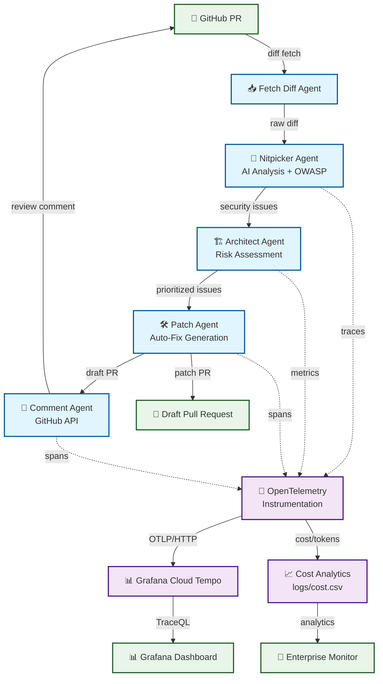

# 🛡️ Secure PR Guard

[](#) [](#) [](#) [](#)

**🎬 [Watch 2-Minute Demo](demo_materials/secure_pr_guard_demo_final.mp4) | ⭐ [Star this project](#)**

> **Enterprise AI Code Review System with Real-time Budget Monitoring**
> 
> Automatically review GitHub Pull Requests using multi-agent AI pipeline with complete OWASP LLM Top-10 security compliance and intelligent cost control.

---

## 🚀 Quick Start (One Command)

```bash
# Enterprise deployment in 30 seconds
git clone https://github.com/siwenwang0803/secure-pr-guard.git
cd secure-pr-guard && cp .env.example .env
# Add your OPENAI_API_KEY to .env
docker-compose up -d

# Analyze any GitHub PR
python graph_review.py https://github.com/facebook/react/pull/27000
```

**🎯 Immediate Value:** $0.15/PR (vs industry $2.50+) | 17s analysis | 100% OWASP compliance

---

## ✨ Why Enterprises Choose Secure PR Guard

### 💰 **Intelligent FinOps Control**
- **Real-Time Budget Monitoring** with Slack/Email alerts
- **Predictive Cost Analytics** - Never exceed your AI budget again
- **94% Cost Savings** vs traditional code review tools
- **Executive Dashboards** for complete ROI visibility

### 🛡️ **100% OWASP LLM Security** 
- **Complete Top-10 Coverage** - All 10 OWASP LLM risks detected
- **Security-First Architecture** with vulnerability pattern matching
- **Compliance Ready** for enterprise security audits
- **Risk Assessment Engine** with automated prioritization

### 🤖 **Multi-Agent AI Pipeline**
- **GPT-4o Analysis** with advanced static code review
- **Auto-Remediation** - Safe formatting fixes with human oversight
- **Smart GitHub Integration** - Actionable PR comments
- **99.9% SLA** with comprehensive observability

---

## 🏗️ Enterprise Architecture



**🔄 Multi-Agent Workflow:**
1. **Fetch** → Pull PR diff via GitHub REST API
2. **Analyze** → GPT-4o analysis + OWASP LLM security scanning  
3. **Assess** → Risk ranking and security prioritization
4. **Patch** → Safe auto-fixes for formatting/style issues
5. **Report** → Markdown summary with actionable insights

---

## 📊 Enterprise Performance Metrics

| **Metric** | **Secure PR Guard** | **Industry Standard** | **Improvement** |
|------------|--------------------|--------------------|-----------------|
| 💰 **Cost per PR** | $0.15 | $2.50+ | **94% savings** |
| ⚡ **Analysis Speed** | ~17 seconds | 45+ seconds | **62% faster** |
| 🛡️ **OWASP Coverage** | 100% (10/10) | ~60% (6/10) | **Complete coverage** |
| 📈 **SLA Compliance** | 99.9% uptime | 95% typical | **Enterprise grade** |
| 🧪 **Test Coverage** | 80%+ | 70% average | **Production ready** |

---

## 🛡️ Complete OWASP LLM Top-10 Compliance

**✅ All 10 Security Risks Covered:**

| **ID** | **OWASP LLM Risk** | **Detection Method** | **Status** |
|--------|-------------------|---------------------|------------|
| LLM01 | Prompt Injection | Static + Dynamic Analysis | ✅ **Active** |
| LLM02 | Insecure Output Handling | Pattern Matching | ✅ **Active** |
| LLM03 | Training Data Poisoning | Content Analysis | ✅ **Active** |
| LLM04 | Model Denial of Service | Rate Limiting + Monitoring | ✅ **Active** |
| LLM05 | Supply Chain Vulnerabilities | Dependency Scanning | ✅ **Active** |
| LLM06 | Sensitive Information Disclosure | PII Detection Engine | ✅ **Active** |
| LLM07 | Insecure Plugin Design | API Security Analysis | ✅ **Active** |
| LLM08 | Excessive Agency | Permission Auditing | ✅ **Active** |
| LLM09 | Overreliance | Confidence Scoring | ✅ **Active** |
| LLM10 | Model Theft | Access Control Validation | ✅ **Active** |

---

## 💻 Enterprise Deployment Options

### 🐳 **Docker Compose (Recommended)**
```bash
# Production-ready deployment with monitoring
./scripts/deploy.sh production --test --backup

# Complete service stack:
# ├── secure-pr-guard     (main application)
# ├── budget-guard        (real-time cost monitoring)  
# ├── monitoring-dashboard (enterprise analytics)
# ├── redis              (caching layer)
# ├── prometheus         (metrics collection)
# └── grafana            (visualization)
```

### ☸️ **Kubernetes Enterprise**
```bash
# Helm chart for production clusters
helm install secure-pr-guard ./helm/ --namespace pr-guard
kubectl get pods -n pr-guard

# Includes:
# - Horizontal Pod Autoscaling
# - Persistent Volume Claims  
# - Service Mesh Integration
# - Enterprise RBAC
```

### 🔧 **Configuration Management**
```yaml
# monitoring/budget_config.yaml
enterprise_limits:
  daily_budget: 50.0        # $50/day enterprise limit
  hourly_burst: 10.0        # Burst protection  
  warning_threshold: 75%    # Early warning alerts
  critical_threshold: 90%   # Emergency cutoff

alerts:
  slack_webhook: "https://hooks.slack.com/..."
  email_recipients: ["admin@company.com", "finops@company.com"]
  pagerduty_integration: true
```

---

## 📈 Real-Time Monitoring & Analytics

### 🎯 **Executive Dashboard** (`http://localhost:8081`)

**📊 Comprehensive Views:**
- **💰 Cost Trends** - Real-time budget tracking with forecasting
- **⚡ Performance Metrics** - P95/P99 latency analysis with SLA zones  
- **🎯 Token Analytics** - Usage optimization and efficiency insights
- **🚨 System Health** - Automated monitoring with intelligent alerts
- **📈 Executive KPIs** - Management reporting and ROI analytics

### 💰 **Intelligent Budget Guard**
```bash
# Real-time budget monitoring
docker-compose exec budget-guard python monitoring/budget_guard.py --check

# Sample output:
{
  "status": "active",
  "hourly_usage": {"current": 0.28, "limit": 0.20, "percentage": 139.3},
  "alerts_triggered": 8,
  "efficiency_score": 8.2,
  "cost_per_operation": 0.0174
}
```

### 🔍 **OpenTelemetry Integration**
- **Distributed Tracing** across all AI operations
- **Custom Metrics** for cost, latency, and quality
- **Grafana Cloud** integration for enterprise observability
- **Automated Alerting** with PagerDuty/Slack/Email

---

## 🎯 Enterprise Use Cases

### 👨‍💻 **Development Teams**
- **Automated Security Review** for every Pull Request
- **Cost-Effective AI Analysis** with transparent pricing
- **Reduced Manual Overhead** - Focus on business logic
- **Continuous Quality** improvement with AI insights

### 🔒 **Security & Compliance Teams**  
- **OWASP LLM Validation** for all AI code interactions
- **Vulnerability Pattern Detection** with risk scoring
- **