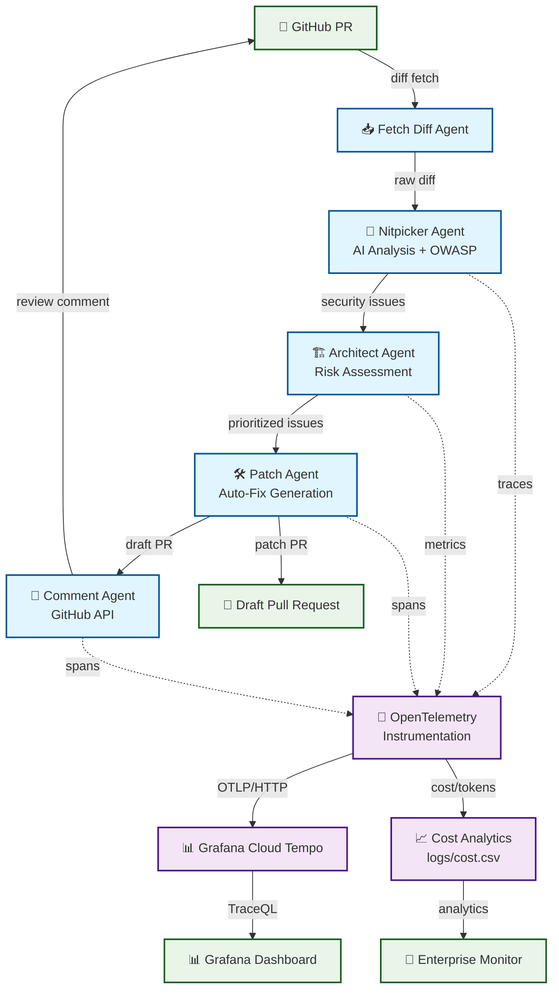

# 🛡️ Secure PR Guard

[](#) [](#) [](#) [](#) [](https://github.com/marketplace/actions/secure-pr-guard)

**🎬 [Demo Video](demo_materials/secure_pr_guard_demo_final.mp4) | ⭐ [Star this project](https://github.com/siwenwang0803/secure-pr-guard)**

> **Multi-Agent AI Code Review System with OWASP LLM Compliance and Cost Monitoring**
> 
> Automatically analyzes GitHub Pull Requests using GPT-4o with complete OWASP LLM Top-10 security scanning and real-time budget tracking via OpenTelemetry.

---

## 🚀 GitHub Action - One-Click Integration

### Quick Setup for CI/CD
Add this workflow to `.github/workflows/security-review.yml`:

```yaml
name: AI Security Review
on: 
  pull_request:
    branches: [main]

jobs:
  security-analysis:
    runs-on: ubuntu-latest
    steps:
      - uses: actions/checkout@v4
      - name: Secure PR Guard Analysis
        uses: siwenwang0803/secure-pr-guard@v1.0.2
        with:
          openai_api_key: ${{ secrets.OPENAI_API_KEY }}
          cost_limit: '1.00'
          analysis_depth: 'standard'
```

### GitHub Action Inputs
| Input | Description | Default | Required |
|-------|-------------|---------|----------|
| `openai_api_key` | OpenAI API key for AI analysis | - | ✅ |
| `cost_limit` | Maximum cost limit in USD | `0.50` | ❌ |
| `analysis_depth` | Analysis depth: `basic`, `standard`, `comprehensive` | `standard` | ❌ |

### GitHub Action Outputs
- `analysis_cost` - Total analysis cost in USD
- `security_issues_found` - Number of security issues detected
- `owasp_compliance_score` - OWASP LLM compliance score (0-100)
- `analysis_summary` - Human-readable analysis summary

### Pricing
- **Basic Analysis**: ~$0.015 per PR
- **Standard Analysis**: ~$0.025 per PR  
- **Comprehensive Analysis**: ~$0.045 per PR

---

## 🚀 Quick Start (Self-Hosted)

```bash
# Clone and setup
git clone https://github.com/siwenwang0803/secure-pr-guard.git
cd secure-pr-guard && cp .env.example .env
# Add your OPENAI_API_KEY to .env

# One-command deployment
docker-compose up -d

# Analyze any GitHub PR
python graph_review.py https://github.com/facebook/react/pull/27000
```

**Access monitoring dashboard:** `http://localhost:8081`

---

## 🚀 Quick Start

```bash
# Clone and setup
git clone https://github.com/siwenwang0803/secure-pr-guard.git
cd secure-pr-guard && cp .env.example .env
# Add your OPENAI_API_KEY to .env

# One-command deployment
docker-compose up -d

# Analyze any GitHub PR
python graph_review.py https://github.com/facebook/react/pull/27000
```

**Access monitoring dashboard:** `http://localhost:8081`

---

## 🏗️ Architecture



**Multi-Agent Workflow:**
1. **Fetch Agent** → Retrieves PR diff via GitHub REST API
2. **Nitpicker Agent** → GPT-4o analysis + OWASP LLM security scanning  
3. **Architect Agent** → Risk assessment and prioritization
4. **Patch Agent** → Generates safe auto-fixes for formatting issues
5. **Comment Agent** → Posts markdown summary to GitHub PR

---

## ✨ Key Features

### 🤖 **Multi-Agent AI Pipeline**
- **GPT-4o Integration** with structured prompting for code analysis
- **Agent Orchestration** using LangGraph for reliable workflow execution
- **Patch Generation** with safe auto-fixes for style and formatting issues
- **GitHub Integration** via REST API for seamless PR commenting

### 🛡️ **OWASP LLM Top-10 Security Compliance**
- **Complete Coverage** of all 10 OWASP LLM security risks
- **Static Analysis** with custom vulnerability pattern detection
- **Dynamic Scanning** during AI model interactions
- **Risk Scoring** and prioritization for security findings

### 💰 **Real-Time Cost Monitoring**
- **OpenTelemetry Integration** for distributed tracing and metrics
- **Budget Guards** with configurable thresholds and multi-channel alerts
- **Token Analytics** with detailed usage breakdowns and efficiency metrics
- **Cost Attribution** per PR, agent, and operation for transparency

### 📊 **Enterprise Observability**
- **Grafana Dashboard** with 9 comprehensive monitoring views
- **SLA Tracking** with P95/P99 latency analysis
- **Health Monitoring** with automated alerting via Slack/Email
- **Executive Reporting** with cost and performance KPIs

---

## 🛡️ OWASP LLM Top-10 Implementation

| **Risk ID** | **OWASP Category** | **Detection Method** | **Implementation** |
|-------------|-------------------|---------------------|-------------------|
| LLM01 | Prompt Injection | Static + Dynamic Analysis | Input sanitization + pattern matching |
| LLM02 | Insecure Output Handling | Response validation | Output encoding + content filtering |
| LLM03 | Training Data Poisoning | Content analysis | Source validation + integrity checks |
| LLM04 | Model Denial of Service | Rate limiting + monitoring | Request throttling + circuit breakers |
| LLM05 | Supply Chain Vulnerabilities | Dependency scanning | Package analysis + vulnerability DB |
| LLM06 | Sensitive Information Disclosure | PII detection | Data classification + redaction |
| LLM07 | Insecure Plugin Design | API security analysis | Permission validation + sandbox execution |
| LLM08 | Excessive Agency | Permission auditing | Capability restriction + approval flows |
| LLM09 | Overreliance | Confidence scoring | Uncertainty quantification + human review |
| LLM10 | Model Theft | Access control validation | Authentication + usage monitoring |

---

## 💻 Deployment

### 🐳 **Docker Compose (Recommended)**
```bash
# Development deployment
docker-compose up -d

# Production deployment with monitoring
./scripts/deploy.sh production

# Services included:
# ├── secure-pr-guard     (main application)
# ├── budget-guard        (cost monitoring)  
# ├── monitoring-dashboard (analytics)
# ├── redis              (caching)
# ├── prometheus         (metrics)
# └── grafana            (visualization)
```

### ☸️ **Kubernetes**
```bash
# Helm chart deployment
helm install secure-pr-guard ./helm/ --namespace pr-guard
kubectl get pods -n pr-guard
```

### 🔧 **Configuration**
```bash
# Environment variables
OPENAI_API_KEY=sk-your-key-here           # Required: OpenAI API access
OPENAI_ORG_ID=org-your-org-here          # Optional: Organization ID

# Budget monitoring
BUDGET_DAILY_LIMIT=50.0                   # Daily budget limit in USD
BUDGET_HOURLY_LIMIT=10.0                  # Hourly burst protection
SLACK_WEBHOOK_URL=https://hooks.slack.com/... # Alert notifications

# Observability
OTEL_EXPORTER_OTLP_ENDPOINT=https://tempo... # Grafana Cloud integration
```

---

## 📊 Technical Specifications

### **Performance Metrics**
- **Average Analysis Time**: ~17 seconds per PR
- **Token Efficiency**: ~970 tokens per analysis (850 prompt + 120 completion)
- **Cost Per Operation**: ~$0.015 USD with GPT-4o pricing
- **P95 Latency**: <30 seconds end-to-end
- **Test Coverage**: 80%+ with comprehensive CI/CD

### **Scalability**
- **Concurrent PRs**: Up to 5 parallel analyses
- **Rate Limiting**: Configurable per OpenAI tier
- **Memory Usage**: ~512MB per worker process
- **Storage**: <100MB for logs and metrics (daily rotation)

### **Security**
- **API Key Management**: Environment variables with optional secrets manager
- **Network Security**: Container isolation with minimal surface area
- **Data Handling**: No persistent storage of code or analysis results
- **Audit Logging**: Complete OpenTelemetry trace for compliance

---

## 📈 Monitoring & Analytics

### **Real-Time Dashboard**
Access comprehensive monitoring at `http://localhost:8081`:

- **💰 Cost Trends** - Budget usage with forecasting
- **⚡ Performance Metrics** - Latency distribution and SLA zones  
- **🎯 Token Analytics** - Usage patterns and optimization insights
- **🚨 System Health** - Service status and error rates
- **📋 Operations Log** - Detailed analysis history

### **Budget Configuration**
```yaml
# monitoring/budget_config.yaml
limits:
  daily_budget: 50.0
  hourly_budget: 10.0
  warning_threshold: 0.75
  critical_threshold: 0.90

notifications:
  slack_webhook: "https://hooks.slack.com/..."
  email_recipients: ["admin@company.com"]
  console_logging: true
```

### **OpenTelemetry Integration**
```python
# Custom metrics and tracing
from opentelemetry import trace, metrics

tracer = trace.get_tracer(__name__)
meter = metrics.get_meter(__name__)

# Track analysis operations
with tracer.start_as_current_span("pr_analysis") as span:
    span.set_attribute("pr.number", pr_number)
    span.set_attribute("cost.tokens", total_tokens)
```

---

## 🛠️ Development

### **Setup**
```bash
# Development environment
python -m venv venv
source venv/bin/activate
pip install -r requirements.txt

# Install pre-commit hooks
pre-commit install

# Run tests
pytest tests/ -v --cov=monitoring
```

### **Project Structure**
```
secure-pr-guard/
├── agents/                  # Multi-agent implementation
│   ├── fetch_diff.py       # GitHub API integration
│   ├── nitpicker.py        # AI analysis + OWASP scanning
│   ├── architect.py        # Risk assessment
│   └── patch.py            # Auto-fix generation
├── monitoring/             # Observability and budget control
│   ├── budget_guard.py     # Real-time cost monitoring
│   ├── dashboard.py        # Analytics dashboard
│   └── telemetry.py        # OpenTelemetry instrumentation
├── security/               # OWASP LLM compliance
│   ├── rules/              # Security rule definitions
│   └── validators/         # Input/output validation
└── tests/                  # Comprehensive test suite
```

### **Contributing**
```bash
# Code quality checks
black . && flake8 . && mypy .

# Run security tests
pytest tests/security/ -v

# Update documentation
make docs
```

---

## 🎯 Use Cases

### **Open Source Projects**
- Automated security review for community contributions
- Cost-controlled AI analysis for maintainer teams
- Consistent code quality enforcement

### **Development Teams**
- Real-time feedback on security vulnerabilities
- Budget-aware AI tooling integration
- Comprehensive audit trails for compliance

### **Security Engineers**
- OWASP LLM compliance validation
- AI security risk assessment
- Automated vulnerability detection in AI workflows

---

## 📚 Documentation

- **[Setup Guide](docs/setup.md)** - Detailed installation and configuration
- **[Architecture Guide](docs/architecture.md)** - System design and component overview
- **[API Reference](docs/api.md)** - Agent interfaces and extension points
- **[Security Guide](docs/security.md)** - OWASP compliance and best practices
- **[Monitoring Guide](docs/monitoring.md)** - Dashboard usage and alerting setup

---

## 🤝 Contributing

We welcome contributions! Please see our [Contributing Guide](CONTRIBUTING.md) for details.

### **Development**
- Report bugs via [GitHub Issues](https://github.com/siwenwang0803/secure-pr-guard/issues)
- Submit feature requests with detailed use cases
- Contribute code via Pull Requests with tests

### **Community**
- Join discussions in [GitHub Discussions](https://github.com/siwenwang0803/secure-pr-guard/discussions)
- Share your use cases and feedback
- Help improve documentation and examples

---

## 📄 License

MIT License - see [LICENSE](LICENSE) for details.

---

**Built with:** Python 3.11+, OpenTelemetry, Docker, Grafana, Redis, LangGraph