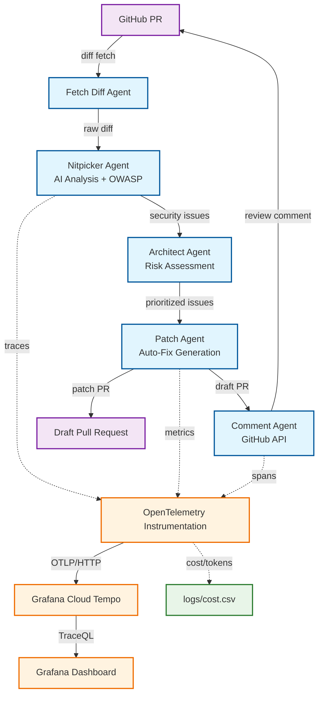

# Secure-PR-Guard

## 🎯 Multi-Agent AI Code Review System  
**Badges**: 🤖 Multi-Agent 🛡️ **100% OWASP LLM Top 10** 💰 Enterprise Cost Monitoring 🚀 FinOps-Ready  

**Objective**: Automatically review GitHub Pull Requests with a chain-of-agents pipeline (analysis → risk → patch → comment), enforce OWASP LLM Top-10 rules, and track cost/performance with OpenTelemetry.

---

## 🏗️ Architecture


```mermaid
graph TD
    %% GitHub Integration
    GH["GitHub PR"] --> |"diff fetch"| FD["Fetch Diff Agent"]

    %% Multi-Agent Pipeline
    FD --> |"raw diff"| NP["Nitpicker Agent<br/>AI Analysis + OWASP"]
    NP --> |"security issues"| AR["Architect Agent<br/>Risk Assessment"]
    AR --> |"prioritized issues"| PA["Patch Agent<br/>Auto-Fix Generation"]
    PA --> |"draft PR"| CM["Comment Agent<br/>GitHub API"]

    %% Output Channels
    CM --> |"review comment"| GH
    PA --> |"patch PR"| PR["Draft Pull Request"]

    %% Observability Layer
    NP -.-> |"traces"| OT["OpenTelemetry Instrumentation"]
    PA -.-> |"metrics"| OT
    CM -.-> |"spans"| OT

    %% Monitoring Stack
    OT --> |"OTLP/HTTP"| GC["Grafana Cloud Tempo"]
    GC --> |"TraceQL"| GB["Grafana Dashboard"]

    %% Cost & FinOps
    OT -.-> |"cost/tokens"| CSV["logs/cost.csv"]

    %% Styling
    classDef agent fill:#e1f5fe,stroke:#01579b,stroke-width:2px
    classDef github fill:#f3e5f5,stroke:#7b1fa2,stroke-width:2px
    classDef observability fill:#fff3e0,stroke:#ef6c00,stroke-width:2px
    classDef storage fill:#e8f5e8,stroke:#2e7d32,stroke-width:2px

    class FD,NP,AR,PA,CM agent
    class GH,PR github
    class OT,GC,GB observability
    class CSV storage
```

## 🔄 Workflow Overview

| Node | Responsibility | Tech |
|------|----------------|------|
| fetch_diff | Pull PR diff via GitHub REST | Python + requests |
| nitpicker | GPT-4o analysis + OWASP rules | GPT-4o-mini |
| architect | Risk ranking & prioritization | Rule-based |
| patch | Low-risk auto-fixes + draft PR | GPT-4o-mini |
| comment | Markdown summary → GitHub comment | GitHub API |

## 🚀 Features

### 🔍 Multi-Agent Analysis
- **AI-Powered Detection**: GPT-4o static analysis & vulnerability patterns
- **OWASP LLM Top 10 Compliance**: Complete 01-10 rule scanning
- **Rule-Based Security**: Hardcoded keys / dangerous imports quick matching

### 🛠️ Automated Remediation
- **Safe Auto-Fixes**: Only format/style/minor changes; high-risk issues flagged only
- **Draft PR Generation**: Auto-branch creation / patch commits
- **Human-in-the-Loop**: Security issues require manual confirmation

### 💰 Enterprise Monitoring
- **Real-Time Cost / Tokens** (OTEL attributes)
- **Performance Latency** (per-operation ms)
- **Audit Trail**: Snapshots & trace history
- **LLM FinOps Copilot** (next milestone)

## 📊 Performance Metrics (2025-06)

| Metric | Value |
|--------|-------|
| Avg Cost / PR | $0.15 |
| End-to-End Latency | ≈ 17 s |
| OWASP Coverage | 100% (10/10) |

## 📈 Observability & Monitoring

Real-time tracking via OpenTelemetry → Grafana Cloud Tempo:

- ⚡ **Avg Latency**: ~1 s per span (95th ≈ 1.8 s)
- 💸 **Cost by Model**: GPT-4o-mini 100%
- 🛡️ **Error Rate**: 0%

<details>
<summary>TraceQL Snippets</summary>

```traceql
# Avg Latency (ms) by operation
{resource.service.name="secure-pr-guard"}
| select(span.latency.ms) | by(span.operation.type)

# Cost (USD) by model
{resource.service.name="secure-pr-guard"}
| select(span.cost.usd) | by(span.cost.model)

# Token split
{resource.service.name="secure-pr-guard"}
| select(span.cost.tokens.prompt, span.cost.tokens.completion)
```

</details>

## 🛡️ Security — 100% OWASP LLM Top 10

| ID | Rule | Status |
|----|------|--------|
| LLM01 | Prompt Injection | ✅ |
| LLM02 | Insecure Output Handling | ✅ |
| LLM03 | Training-Data Poisoning / Prompt Leak | ✅ |
| LLM04 | Model DoS | ✅ |
| LLM05 | Supply-Chain / Auth Bypass | ✅ |
| LLM06 | Sensitive Info Disclosure | ✅ |
| LLM07 | Insecure Plugin | ✅ |
| LLM08 | Excessive Agency | ✅ |
| LLM09 | Over-Reliance | ✅ |
| LLM10 | Model Theft | ✅ |

CI runs `final_comprehensive_test.py` (79 checks, < 0.03 s) across Python 3.9 / 3.11.

## 📈 Cost Analysis

```csv
timestamp,pr_url,operation,model,prompt_tokens,completion_tokens,total_tokens,cost_usd,latency_ms
1719360123,https://github.com/user/repo/pull/1,nitpicker_analysis,gpt-4o-mini,856,42,898,0.0013,9634
1719360125,https://github.com/user/repo/pull/1,patch_generation,gpt-4o-mini,1199,89,1288,0.0019,7831
```

## 🏗 Project Tree (abridged)

```bash
secure-pr-guard/
├── docs/               # diagrams & dashboard
├── logs/               # cost.csv, snap_*.json
├── agents/             # nitpicker / architect / patch / comment
├── cost_logger.py      # OTEL + CSV FinOps
├── graph_review.py     # Orchestrator
├── tests/              # LLM01-10 & comprehensive
└── requirements.txt
```

## 🚀 Getting Started

<details>
<summary>Setup & Run</summary>

```bash
git clone https://github.com/siwenwang0803/secure-pr-guard.git
cd secure-pr-guard
python -m venv .venv && source .venv/bin/activate
pip install -r requirements.txt
cp .env.example .env  # add keys

# full review run
python graph_review.py https://github.com/owner/repo/pull/123
```

</details>

## 🎯 Enterprise-Ready Checklist

| Capability | Status |
|------------|--------|
| Cost & Token FinOps | ✅ |
| OTEL Distributed Tracing | ✅ |
| 100% OWASP LLM Top-10 | ✅ |
| Audit Trail / Snapshots | ✅ |
| Scalable Agent Orchestration | ✅ |

## 📝 License

MIT

Built with ❤️ by Multi-Agent AI • OWASP LLM Top 10 Compliant • FinOps-Ready